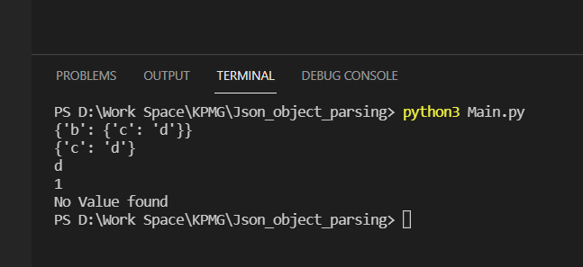

# Json_object_parsing
Value retrieval by parsing Json for the input key provided

## Prerequisites & Execution Process
- Make sure Python3 installed
- Make sure pip3 installed
- Make sure requests module installed in Python (pip3 install requests)
- Clone/download Main.py into a Specific location
- execute python script (python3 Main.py)
- Can alter the inputs and key to be passed to python function for different output expectations.

## Executed output screenshorts

